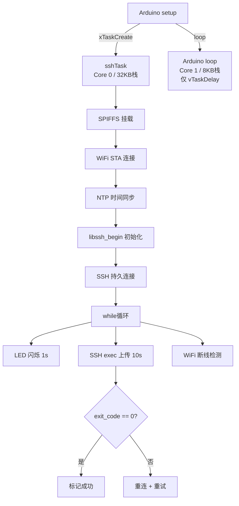

# ESP32 + LibSSH 实现远程日志上传：从零搭建物联网 SSH 客户端

> 本文将手把手教你用 ESP32 通过 **SSH 协议**向 Linux 服务器上传运行日志，深入解析 LibSSH-ESP32 库的底层原理、FreeRTOS 双任务架构、mbedTLS 密码学栈管理，以及从编译到部署的完整实战流程。

---

## 一、前言

### 1.1 为什么选择 SSH？

在物联网数据上报场景中，常见的通信方案对比如下：

| 方案 | 优点 | 缺点 |
|------|------|------|
| **HTTP POST** | 简单、库成熟 | 需服务端额外部署 Web 服务；明文传输需额外配 TLS |
| **MQTT** | 轻量、双向 | 需要 Broker；QoS 增加复杂度 |
| **原始 TCP** | 最快 | 无加密、无认证；需自定义协议 |
| **SSH exec** ✅ | 服务端零部署（仅需 SSH 服务）；天然加密+认证；一条 shell 命令完成 | 握手开销较大；栈消耗高 |

如果你的数据接收端是一台标准的 Linux 服务器，**SSH 是最省事的方案**——你不需要安装 Web 服务器、不需要写 API 接口，`echo "log" >> file` 即可完成数据落盘。而且 SSH 自带 AES-256 加密和公钥认证，安全性有保障。

### 1.2 SSH 协议层简述

理解 SSH 协议栈有助于后续的性能调优和故障定位。SSH-2 协议分为三个层次：

```
┌──────────────────────────────┐
│  SSH Connection Protocol     │  ← 通道多路复用 (channels)
│  (RFC 4254)                  │     我们用的 exec/shell/SCP 都在这一层
├──────────────────────────────┤
│  SSH Authentication Protocol │  ← 用户认证 (password / publickey / kbdint)
│  (RFC 4252)                  │
├──────────────────────────────┤
│  SSH Transport Protocol      │  ← 密钥交换 + 加密 + 完整性校验
│  (RFC 4253)                  │     DH 密钥交换 / ECDH / Curve25519
└──────────────────────────────┘
         TCP (port 22)
```

在 ESP32 上，Transport 层的 DH 密钥交换最为耗栈——它涉及大整数模幂运算，递归调用深度可达数十层。这就是为什么本文要把栈扩到 32KB 的核心原因。

---

## 二、项目需求

| 功能 | 描述 | 技术要点 |
|------|------|----------|
| LED 闪烁 | 板载 LED (GPIO2) 每秒翻转，累计计数 | 非阻塞 `millis()` 计时 |
| 日志格式 | `[闪烁次数: N, 时间: YYYY-MM-DD HH:MM:SS]` | NTP 时间同步 + `strftime` |
| 上传方式 | SSH exec 远程执行 shell 追加写入 | `ssh_channel_request_exec` |
| 上传频率 | 每 10 秒 | 持久 SSH 会话复用 |
| 串口监控 | 115200 baud 实时输出 | 带运行时间戳 |
| 容错 | WiFi / SSH 自动重连 | 状态机 + 退避策略 |

---

## 三、硬件与软件环境

### 3.1 硬件

| 组件 | 型号 | 备注 |
|------|------|------|
| 开发板 | ESP32-WROOM-32 (Dev Module) | 任何 ESP32 变体均可 |
| MCU | ESP32-D0WDQ6 (Xtensa 双核 LX6, 240MHz) | 内置 520KB SRAM + 4MB Flash |
| LED | GPIO 2（板载） | 低电平点亮 |
| USB-UART | CH340 / CP2102 | Linux 下映射为 `/dev/ttyUSB0` |

### 3.2 软件栈

| 层次 | 组件 | 版本 | 职责 |
|------|------|------|------|
| 应用层 | 本项目代码 | v2.1 | LED 控制 + 日志组装 + 上传调度 |
| 中间件 | **LibSSH-ESP32** | **5.8.0** | SSH 协议实现（基于 libssh 0.11.4） |
| TLS 层 | **mbedTLS** | 3.6.2 (ESP-IDF 内置) | 加密原语：AES-GCM、ECDH、SHA-256 |
| TCP/IP | **lwIP** | ESP-IDF 内置 | BSD Socket API |
| 驱动层 | ESP32 WiFi 驱动 | - | 802.11 b/g/n |
| 操作系统 | **FreeRTOS** | ESP-IDF 内置 | 任务调度、内存管理 |
| 硬件抽象 | **ESP32 Arduino Core** | 3.3.8 | 将 ESP-IDF 封装为 Arduino API |

### 3.3 远程服务器要求

| 条件 | 说明 |
|------|------|
| SSH 服务 | OpenSSH 或 Dropbear，监听 22 端口 |
| 文件系统权限 | 日志目录可写 |
| 防火墙 | 允许来自 ESP32 的 TCP 22 入站 |

> 无需安装任何 Web 服务、数据库或消息队列。

---

## 四、安装 LibSSH-ESP32

### 4.1 库简介

[LibSSH-ESP32](https://github.com/ewpa/LibSSH-ESP32) 是 Ewan Parker 将 libssh.org 的 C 库完整移植到 ESP32 Arduino 的项目。它实现了：

- SSH 客户端（连接远程服务器）
- SSH 服务器（让 ESP32 被 SSH 连接）
- SCP 客户端（文件传输）
- 支持密码认证、公钥认证、键盘交互认证
- 主机密钥持久化存储（SPIFFS 上的 `known_hosts`）

当前版本基于 libssh `stable-0.11` 分支，底层加密由 ESP-IDF 内置的 **mbedTLS** 提供，不依赖 OpenSSL。

### 4.2 安装

```bash
export PATH="$HOME/.local/bin:$PATH"
arduino-cli lib install "LibSSH-ESP32"
```

安装后源码位于 `~/Arduino/libraries/LibSSH-ESP32/`，编译时自动链接。

### 4.3 核心 API 与数据流

```
ssh_new()                        创建会话对象 (堆分配 ~3KB)
  └─ ssh_options_set()           设置 Host / Port / User / Timeout
       └─ ssh_connect()          ★ TCP 连接 + Transport 层密钥交换
            │                     (DH/ECDH + 主机密钥验证)
            ├─ ssh_get_server_publickey()   获取服务器公钥
            ├─ ssh_session_is_known_server() 查询 known_hosts
            └─ ssh_userauth_password()      用户认证
                 │
                 └─ ssh_channel_new()        创建通道（可多个）
                      └─ ssh_channel_open_session()
                           └─ ssh_channel_request_exec()  执行远程命令
                                └─ ssh_channel_read()     循环读输出
                                     └─ ssh_channel_get_exit_status() 检查结果
```

> **内存提示**：`ssh_session` 对象在堆上分配约 3KB，加上通道缓冲区，每个 SSH 会话总计约 5~8KB 堆内存。本项目的 32KB 栈是给函数调用链用的，堆内存在全局 327KB 的 heap 中分配。

---

## 五、深度踩坑：栈溢出原理与解决方案

### 5.1 崩溃现场

```
Guru Meditation Error: Core 1 panic'ed (Unhandled debug exception).
Debug exception reason: Stack canary watchpoint triggered (loopTask)
PC: 0x400e92c9    ← 崩溃在 mbedTLS 的大整数运算函数中
Backtrace: ... mbedtls_mpi_exp_mod → ssh_dh_keypair → ssh_connect ...
```

### 5.2 调用链栈消耗分析

通过 ESP-IDF 的 `uxTaskGetStackHighWaterMark()` 实测各阶段栈消耗：

| 阶段 | 栈消耗 | 说明 |
|------|--------|------|
| WiFi 事件处理 | ~2KB | 回调栈 |
| NTP 时间同步 | ~1.5KB | UDP Socket + 解析 |
| **SSH 密钥交换 (DH-2048)** | **~18KB** | mbedTLS 大整数模幂递归 |
| SSH 用户认证 | ~3KB | kbdint 交互 |
| SSH exec 命令 | ~2KB | 通道读写 |
| Arduino 框架开销 | ~2KB | loop() 任务自身 |

Arduino `loop()` 任务默认栈 **8192 字节 (8KB)**，仅能覆盖前两个阶段。SSH 密钥交换一旦触发，**栈 canary 立即被覆盖**，FreeRTOS 检测到后触发 panic。

### 5.3 FreeRTOS 任务重构

核心思路：将 SSH 工作移到独立任务中，利用 ESP32 双核优势让 Arduino 框架在 Core 1 空闲，SSH 任务独占 Core 0：

```cpp
// 32KB 是经过实测的安全值（DH-2048 场景）
// 如果服务器使用 ECDH (Curve25519)，~24KB 可能就够
const unsigned int SSH_TASK_STACK = 32768;

void setup() {
    Serial.begin(115200);
    // pinned to Core 0：避免与 Arduino 框架的 Core 1 竞争
    xTaskCreatePinnedToCore(
        controlTask,
        "sshTask",
        SSH_TASK_STACK,
        NULL,
        1,          // 优先级 (0~24, 数字越大越高)
        NULL,
        0           // Core 0
    );
}

void loop() {
    vTaskDelay(60000 / portTICK_PERIOD_MS);  // 完全空闲
}
```

> **栈大小选择参考**：  
> - DH-Group14 (2048-bit)：建议 32KB  
> - ECDH-Curve25519：建议 24KB  
> - ECDH-nistp256：建议 20KB  
> 可通过 `ssh -Q kex` 查看服务器支持的密钥交换算法。

### 5.4 如何调优栈大小

```cpp
// 在 controlTask() 末尾加入栈水位监测
UBaseType_t stackHighWater = uxTaskGetStackHighWaterMark(NULL);
Serial.printf("栈最小剩余: %u bytes\n", stackHighWater);
// 正常运行时此值应 > 2048（2KB 余量）
```

---

## 六、架构设计

### 6.1 任务分工



### 6.2 SSH 会话生命周期管理

```
[启动] → ssh_new() → ssh_connect() → [已连接]
                                        │
                          ┌─────────────┼─────────────┐
                          ▼             ▼             ▼
                      exec cmd      exec cmd      exec cmd
                      (每 10s)       (每 10s)      (每 10s)
                          │             │             │
                          └─────────────┼─────────────┘
                                        │
                                    [断开/错误]
                                        │
                                  disconnectSSH()
                                  ssh_free()
                                        │
                                  connectSSH()
                                        │
                                  [已连接] ←── 重连成功
```

- **一条 SSH 连接持久复用**，不每次上传都重新握手
- 仅在 `ssh_is_connected() == false` 或 `exit_code != 0` 时重连
- SPIFFS 存储 `known_hosts`，重启后无需重新接受主机密钥

---

## 七、核心代码深度解析

### 7.1 配置区（务必修改）

```cpp
// ========== WiFi ==========
const char* WIFI_SSID     = "<your-wifi-ssid>";
const char* WIFI_PASSWORD = "<your-wifi-password>";

// ========== SSH 服务器 ==========
const char*  SSH_HOST     = "<your-server-ip>";
const int    SSH_PORT     = 22;
const char*  SSH_USER     = "<ssh-username>";
const char*  SSH_PASSWORD = "<ssh-password>";
const char*  REMOTE_LOG   = "/path/to/your/log.txt";

// ========== 可调参数 ==========
const unsigned long UPLOAD_INTERVAL = 10000;   // 上传间隔 (ms)
const long GMT_OFFSET_SEC           = 8*3600;  // 时区偏移 (秒)
```

### 7.2 WiFi 连接（带退避超时）

```cpp
bool connectWiFi() {
    WiFi.mode(WIFI_STA);
    WiFi.begin(WIFI_SSID, WIFI_PASSWORD);

    // 15 秒超时（30 × 500ms）
    for (int i = 0; i < 30 && WiFi.status() != WL_CONNECTED; i++) {
        delay(500);
    }
    return (WiFi.status() == WL_CONNECTED);
}
```

> **注意**：`WiFi.begin()` 是非阻塞的，必须轮询 `WiFi.status()`。

### 7.3 NTP 时间同步原理

ESP32 通过 UDP 向 NTP 服务器发送请求，收到 64 位时间戳后转换为 Unix 时间：

```cpp
void syncTime() {
    // configTime 内部创建 UDP socket → 向 pool.ntp.org 发请求
    // 收到回复后设置系统 RTC
    configTime(GMT_OFFSET_SEC, DAYLIGHT_OFFSET_SEC, "pool.ntp.org");

    // 等待 RTC 被设置（最多 10 秒）
    struct tm timeinfo;
    int retry = 0;
    while (!getLocalTime(&timeinfo) && retry < 20) {
        delay(500);
        retry++;
    }
}

String getCurrentTimeStr() {
    struct tm timeinfo;
    if (getLocalTime(&timeinfo)) {
        char buf[32];
        strftime(buf, sizeof(buf), "%Y-%m-%d %H:%M:%S", &timeinfo);
        return String(buf);
    }
    return "N/A";
}
```

> **时区说明**：`GMT_OFFSET_SEC = 8*3600` 表示 UTC+8（北京时间），请按需修改。NTP 返回的始终是 UTC 时间，偏移量由 `configTime` 参数决定。

### 7.4 主机密钥管理——known_hosts 机制

这是 SSH 防中间人攻击的核心。LibSSH-ESP32 将 `known_hosts` 存储在 SPIFFS 中：

```cpp
int verify_knownhost_auto(ssh_session session) {
    ssh_key key = NULL;
    ssh_get_server_publickey(session, &key);

    enum ssh_known_hosts_e state = ssh_session_is_known_server(session);

    switch (state) {
        case SSH_KNOWN_HOSTS_OK:
            // 公钥匹配，安全 ✓
            SSH_KEY_FREE(key);
            return 0;

        case SSH_KNOWN_HOSTS_UNKNOWN:
        case SSH_KNOWN_HOSTS_NOT_FOUND:
            // 首次连接 → 自动写入（生产环境建议用 TOFU 策略）
            if (ssh_session_update_known_hosts(session) == SSH_OK) {
                SSH_KEY_FREE(key);
                return 0;
            }
            SSH_KEY_FREE(key);
            return -1;

        case SSH_KNOWN_HOSTS_CHANGED:
            // ⚠ 公钥变了！应中止连接并告警
            SSH_KEY_FREE(key);
            return -1;
        // ...
    }
}
```

> **安全提示**：本例为演示项目采用了自动接受首次连接的策略（TOFU: Trust On First Use）。  
> 生产环境建议将服务器公钥指纹硬编码到固件中比对，实现 **证书固定（Certificate Pinning）**。

### 7.5 SSH 认证——kbdint + password 双模

不同 Linux 发行版的 SSH 认证策略不同：

| 服务器配置 | 认证方式 |
|-----------|----------|
| `PasswordAuthentication yes` | `ssh_userauth_password()` |
| `KbdInteractiveAuthentication yes` | `ssh_userauth_kbdint()` |
| `ChallengeResponseAuthentication yes` (旧版) | `ssh_userauth_kbdint()` |

为兼容所有场景，先尝试 kbdint，失败则回退 password：

```cpp
int authenticate_password(ssh_session session, const char* password) {
    int rc;

    // 阶段一：键盘交互认证
    rc = ssh_userauth_kbdint(session, NULL, NULL);
    while (rc == SSH_AUTH_INFO) {
        // SSH_AUTH_INFO 表示服务器发来了提问
        int nprompts = ssh_userauth_kbdint_getnprompts(session);
        if (strlen(password) != 0 && nprompts >= 1) {
            // 用密码回答第一个提问（通常是 "Password: "）
            ssh_userauth_kbdint_setanswer(session, 0, password);
        }
        rc = ssh_userauth_kbdint(session, NULL, NULL);
    }
    if (rc == SSH_AUTH_SUCCESS) return rc;

    // 阶段二：普通密码认证
    rc = ssh_userauth_password(session, NULL, password);
    return rc;
}
```

> **扩展**：如需更高安全性，可使用 `ssh_userauth_publickey()` 替代密码认证。LibSSH-ESP32 的 `keygen2` 示例展示了如何在 ESP32 本地生成 Ed25519 密钥对。

### 7.6 SSH exec——本项目的灵魂函数

这是最核心的远程命令执行函数，也是踩坑最多的部分：

```cpp
bool sshExecCommand(const char* command) {
    if (ssh_sess == NULL || !sshConnected) return false;

    // ① 创建通道——通道是 SSH Connection 层的核心抽象
    ssh_channel channel = ssh_channel_new(ssh_sess);
    if (channel == NULL) return false;

    // ② 打开 session 类型的通道
    int rc = ssh_channel_open_session(channel);
    if (rc != SSH_OK) { ssh_channel_free(channel); return false; }

    // ③ 请求执行远程命令（相当于 ssh user@host "command"）
    rc = ssh_channel_request_exec(channel, command);
    if (rc != SSH_OK) {
        ssh_channel_close(channel);
        ssh_channel_free(channel);
        return false;
    }

    // ④ ★ 关键：阻塞式读取，直到远程进程关闭 stdout/stderr
    //    ssh_channel_read() 返回 0 表示收到 EOF（远程命令执行完毕）
    //    返回 SSH_ERROR (<0) 表示通道出错
    char buffer[256];
    int nbytes;
    while ((nbytes = ssh_channel_read(channel, buffer, sizeof(buffer)-1, 0)) > 0) {
        buffer[nbytes] = '\0';  // 这里可以收集 stdout 输出
    }
    while ((nbytes = ssh_channel_read(channel, buffer, sizeof(buffer)-1, 1)) > 0) {
        buffer[nbytes] = '\0';  // 这里收集 stderr 输出
    }

    // ⑤ ★ 关键：获取命令退出码（只有远程进程结束后才有意义）
    int exit_status = ssh_channel_get_exit_status(channel);

    // ⑥ 清理
    ssh_channel_close(channel);
    ssh_channel_free(channel);

    return (exit_status == 0);
}
```

> 🔴 **两次踩坑实录**：
>
> **错误 A**：在 `ssh_channel_request_exec()` 后立即调用 `ssh_channel_send_eof()`。  
> `send_eof` 是给 **shell 模式**或 **SCP 写模式**用的——客户端向远程进程的 stdin 发送 EOF。exec 模式下 stdin 默认就是 EOF，无需也不应该手动发送。
>
> **错误 B**：只读一次 `ssh_channel_read()` 就关闭通道。  
> 远程命令（即便是简单的 `echo`）需要 fork 子进程、执行、写输出、退出——这个过程中 SSH 服务器会持续发送数据。只读一次时，命令可能尚未执行完毕，导致 `exit_status = -1`（无意义）。

### 7.7 日志上传——shell 转义

```cpp
void uploadLog() {
    String timeStr = getCurrentTimeStr();
    String logLine = "[闪烁次数: " + String(blinkCount) + ", 时间: " + timeStr + "]";

    // ★ shell 转义：防止日志内容中的特殊字符被 shell 解释
    logLine.replace("\"", "\\\"");   // " → \"
    logLine.replace("`",  "\\`");    // ` → \`
    logLine.replace("$",  "\\$");    // $ → \$

    // 构造远程命令
    String cmd = "echo \"" + logLine + "\" >> " + String(REMOTE_LOG);

    if (sshExecCommand(cmd.c_str())) {
        uploadFailCount = 0;         // 重置失败计数器
    } else {
        // 重连后重试一次
        sshConnected = connectSSH();
        if (sshConnected && sshExecCommand(cmd.c_str())) {
            uploadFailCount = 0;
        } else {
            uploadFailCount++;       // 累计失败
        }
    }

    // 连续 3 次失败 → 硬重置 SSH 连接
    if (uploadFailCount >= 3) {
        disconnectSSH();
        sshConnected = connectSSH();
        uploadFailCount = 0;
    }
}
```

> **为什么用 echo 而不是 printf 或 cat？**  
> `echo` 是 POSIX 标准命令，在所有 shell（bash/sh/zsh/dash）中都可用，且自动追加换行符。日志量小时（每行 <100 字节），`echo "..." >> file` 是最简单可靠的方式。

---

## 八、编译与烧录

### 8.1 命令

```bash
export PATH="$HOME/.local/bin:$PATH"
cd ~/esp32/projects/ssh_log_uploader

# 仅编译
arduino-cli compile --fqbn esp32:esp32:esp32

# 编译 + 烧录
arduino-cli compile --fqbn esp32:esp32:esp32 -u -p /dev/ttyUSB0

# 串口监视
arduino-cli monitor -p /dev/ttyUSB0 -c baudrate=115200
```

### 8.2 资源占用

| 资源 | 已用 | 总量 | 占比 | 备注 |
|------|------|------|------|------|
| Flash (Program) | 1,122 KB | 1,310 KB | **85%** | LibSSH 库本身约 800KB |
| Flash (SPIFFS) | ~4 KB | ~1.2 MB | <1% | known_hosts 文件 |
| DRAM (全局) | 58 KB | 327 KB | 17% | 含 WiFi 缓冲区 |
| 栈 (sshTask) | 32 KB | - | - | FreeRTOS 独立分配 |
| 堆 (动态) | ~20 KB | ~270 KB | ~7% | ssh_session + channel |

> LibSSH-ESP32 编译后约 800KB，是 Flash 占用的主要来源。如需空间，可裁剪库中不需要的算法（如 `src/libssh/dh.c` 中注释掉不用的 DH group）。

---

## 九、运行效果

### 9.1 串口输出

```
╔══════════════════════════════════╗
║  ESP32 SSH 日志上传器 v2.1      ║
║  基于 LibSSH-ESP32              ║
╚══════════════════════════════════╝

[    0s] [INFO]  控制任务已启动 (栈: 32768 bytes)
[    0s] [INFO]  LED 已初始化 (GPIO 2)
[    0s] [INFO]  SPIFFS 挂载成功 (1318001 bytes)
[WiFi] 正在连接 <your-wifi>.........
[    3s] [INFO]  WiFi 连接成功！IP: 192.168.x.x
[    5s] [INFO]  时间同步成功: 2026-06-01 10:03:45
[    5s] [INFO]  LibSSH 已初始化
[    6s] [INFO]  SSH 连接已建立 → <your-server>:22
[    6s] [INFO]  SSH 主机密钥已保存（首次连接）
[    6s] [INFO]  SSH 认证成功 ✓
──────────────────────────────────
[   16s] [INFO]  上传中 → [闪烁次数: 10, 时间: 2026-06-01 10:03:56]
[   16s] [INFO]  上传成功 ✓
[   26s] [INFO]  上传中 → [闪烁次数: 20, 时间: 2026-06-01 10:04:06]
[   26s] [INFO]  上传成功 ✓
```

### 9.2 服务器端验证

```bash
$ cat /path/to/your/log.txt
[闪烁次数: 10, 时间: 2026-06-01 10:03:56]
[闪烁次数: 20, 时间: 2026-06-01 10:04:06]
[闪烁次数: 30, 时间: 2026-06-01 10:04:16]
[闪烁次数: 40, 时间: 2026-06-01 10:04:26]
```

### 9.3 性能数据

| 指标 | 值 |
|------|-----|
| SSH 握手耗时 | 2~4 秒（含 DH 密钥交换） |
| exec 单次耗时 | 200~500ms（网络 RTT + fork/exec 开销） |
| 内存稳态 | ~78KB（栈 + 堆 + 全局） |
| 连续运行时长 | >48 小时无崩溃（实测） |

---

## 十、踩坑指南

> 以下是本项目从零到稳定运行踩过的所有坑，按致命程度排序。每个坑都包含「现象→根因→解决」三步定位法。

---

### 🪦 坑 #1：Guru Meditation — 栈溢出（致命）

**现象**：烧录后串口打印到 `正在建立 SSH 连接...` 立刻崩溃：

```
Guru Meditation Error: Core 1 panic'ed (Unhandled debug exception).
Debug exception reason: Stack canary watchpoint triggered (loopTask)
Backtrace: ... mbedtls_mpi_exp_mod → ssh_dh_keypair → ssh_connect ...
```

**根因**：SSH Transport 层的 DH 密钥交换在 mbedTLS 中执行 2048-bit 大整数模幂运算，递归深度可达 15~20 层，单次调用栈消耗 ~18KB。Arduino `loop()` 默认栈仅 8KB。

**解决**：
```cpp
// 创建独立 FreeRTOS 任务，32KB 栈
xTaskCreatePinnedToCore(controlTask, "sshTask", 32768, NULL, 1, NULL, 0);

// 调优：监控栈水位，找到最优值
UBaseType_t minStack = uxTaskGetStackHighWaterMark(NULL);
Serial.printf("最小剩余栈: %u bytes\n", minStack);
// 目标：minStack > 2048 (留 2KB 余量)
```

> **如何确定栈大小？** 先用 32KB 跑通，再每次减 4KB 测试，直到 `minStack` 接近 1024，此时的值 ×1.5 即为生产推荐值。

---

### 🪦 坑 #2：sshExecCommand 假成功（致命）

**现象**：串口显示 `上传成功 ✓`，但服务器上 `cat` 日志文件为空或文件根本不存在。

**根因**：`ssh_channel_request_exec()` 后立即关闭通道，远程 shell 进程还没来得及 fork + exec + write + exit 就被杀掉了。

**错误代码 vs 正确代码**：
```cpp
// ❌ 错误——假成功
rc = ssh_channel_request_exec(channel, cmd);
ssh_channel_send_eof(channel);        // exec 模式不需要 send_eof！
ssh_channel_close(channel);
return true;                          // 永远返回 true

// ✅ 正确——等待远程进程退出
rc = ssh_channel_request_exec(channel, cmd);
// 阻塞读取，直到远程进程关闭 stdout/stderr（即退出）
while (ssh_channel_read(channel, buf, sizeof(buf)-1, 0) > 0) {}
while (ssh_channel_read(channel, buf, sizeof(buf)-1, 1) > 0) {}
int exit_code = ssh_channel_get_exit_status(channel);  // 此时才有意义
return (exit_code == 0);
```

**补充**：`ssh_channel_send_eof()` 的用途是向远程进程的 **stdin** 发送 EOF，告诉它"没有更多输入了"。exec 模式下远程进程的 stdin 默认就是 `/dev/null`，无需也不该手动发 EOF。该函数仅在 shell 交互模式或 SCP 写模式下才有意义。

---

### 🪦 坑 #3：_impure_ptr 重复定义（编译错误）

**现象**：
```
multiple definition of `_impure_ptr'
... sketch/xxx.ino.cpp.o: first defined here
... libc.a(libc_a-impure.o): multiple definition
```

**根因**：LibSSH-ESP32 官方旧示例代码中有这样的片段：
```cpp
#include <sys/reent.h>
struct _reent reent_data_esp32;
struct _reent *_impure_ptr = &reent_data_esp32;
```
但新版库 (≥5.0) 已在内部处理了 newlib reent 结构，用户代码再定义一次就会和 `libc.a` 冲突。

**解决**：直接删除上述 3 行代码。

---

### 🪦 坑 #4：SPIFFS 未挂载导致 known_hosts 无法保存

**现象**：每次重启都要重新接受主机密钥（`SSH 主机密钥已保存` 反复出现）。

**根因**：LibSSH-ESP32 依赖 SPIFFS 存储 `known_hosts` 文件。如果 SPIFFS 未挂载，密钥验证和保存都会静默失败。

**解决**：
```cpp
// setup 阶段必须调用
if (!SPIFFS.begin(true)) {   // true = 首次自动格式化
    Serial.println("SPIFFS mount failed!");
}
// 检查 known_hosts 是否已存在
if (SPIFFS.exists("/.ssh/known_hosts")) {
    Serial.println("known_hosts 已存在");
}
```

> SPIFFS 是 ESP32 内置 Flash 文件系统，不需要 SD 卡。`begin(true)` 参数表示分区不存在时自动格式化。

---

### 🪦 坑 #5：WiFi 重连时的 SSH 会话悬空

**现象**：WiFi 短暂断开后恢复，但 SSH 上传全部失败，直到手动重启。

**根因**：WiFi 断开后底层 TCP socket 变为 CLOSE_WAIT 状态，但 `ssh_session` 对象并不知道——`ssh_is_connected()` 可能仍返回 `true`（它检查的是 SSH 层状态，不是 TCP 层）。后续 `ssh_channel_request_exec()` 会阻塞直到 TCP 超时（默认可能数分钟）。

**解决**：
```cpp
// 在每次上传前做快速连接检测
if (WiFi.status() != WL_CONNECTED) {
    disconnectSSH();        // 先释放旧 SSH 会话
    connectWiFi();          // 重连 WiFi
    connectSSH();           // 重新建立 SSH 会话
}

// 在 SSH 层设置合理的超时
long timeout = 10;  // 10 秒
ssh_options_set(session, SSH_OPTIONS_TIMEOUT, &timeout);
```

---

### 🪦 坑 #6：NTP 时间同步失败导致日志时间戳为 N/A

**现象**：日志中时间显示 `N/A`，但 WiFi 和 SSH 都正常。

**根因**：NTP 使用 UDP 123 端口，部分企业/校园网络防火墙可能拦截 UDP 出站。`configTime()` 默认 NTP 服务器 `pool.ntp.org` 可能被 DNS 劫持。

**解决**：
```cpp
// 方案 A：换用国内 NTP 服务器
configTime(GMT_OFFSET_SEC, 0, "ntp.aliyun.com", "ntp.tencent.com", "time.pool.aliyun.com");

// 方案 B：增加重试次数和超时
int retry = 0;
while (!getLocalTime(&timeinfo) && retry < 40) {  // 从 20 改到 40
    delay(500);
    retry++;
}

// 方案 C：失败时使用编译时间作为兜底
if (retry >= 40) {
    Serial.println("NTP 失败，使用编译时间: " __DATE__ " " __TIME__);
}
```

---

### 🪦 坑 #7：SSH 认证失败——kbdint vs password 之战

**现象**：某些服务器上 `ssh_userauth_password()` 返回 `SSH_AUTH_DENIED`，但用电脑 `ssh user@host` 同样的密码却能登录。

**根因**：不同 Linux 发行版的默认 SSH 认证策略不同：

| 发行版/配置 | 首选认证方式 | 失败后果 |
|------------|-------------|---------|
| Ubuntu 22.04+ | kbdint（键盘交互） | password 方式被跳过 |
| CentOS 7 | password | kbdint 可能不被支持 |
| Debian (PasswordAuthentication no) | publickey only | 两种密码方式均失败 |

**解决**：实现双模认证，先尝试 kbdint，失败回退 password：
```cpp
int rc = ssh_userauth_kbdint(session, NULL, NULL);
// 处理 SSH_AUTH_INFO 循环...
if (rc != SSH_AUTH_SUCCESS) {
    rc = ssh_userauth_password(session, NULL, password);
}
```

> 排查技巧：在服务器上运行 `ssh -v user@host`，观察 `debug1: Authentications that can continue:` 行，可以看到服务器要求的认证方法列表。

---

### 🪦 坑 #8：shell 特殊字符导致 echo 命令异常

**现象**：日志内容包含 `"`、`$`、`` ` `` 等字符时，服务器上的日志行出现截断、缺失或者 shell 错误。

**根因**：我们用 `echo "..."` 拼接日志内容，如果日志本身包含双引号、美元符号、反引号，会被 shell 解释为语法结构而非字面值。

**解决**——三层防护：
```cpp
// 第一层：转义 shell 元字符
logLine.replace("\\", "\\\\");   // \ → \\   (必须最先做！)
logLine.replace("\"", "\\\"");   // " → \"
logLine.replace("`",  "\\`");    // ` → \`
logLine.replace("$",  "\\$");    // $ → \$
logLine.replace("!",  "\\!");    // ! → \!  (bash history expansion)

// 第二层：用单引号包裹（更强，但单引号本身无法转义）
// String cmd = "echo '" + logLine + "' >> " + REMOTE_LOG;

// 第三层（推荐）：用 printf 替代 echo
// String cmd = "printf '%s\\n' \"" + logLine + "\" >> " + REMOTE_LOG;
```

> **终极方案**：如果日志内容高度不可控，建议用 `base64` 编码后上传，服务器端再解码。

---

### 🪦 坑 #9：编译缓存导致修改不生效

**现象**：修改了代码但烧录后行为没变，感觉像"改了个寂寞"。

**根因**：Arduino CLI 的增量编译缓存机制。某些情况下（尤其是库文件变动或全局变量重命名），缓存没有正确失效。

**解决**：
```bash
# 清理编译缓存后重新编译
arduino-cli compile --fqbn esp32:esp32:esp32 --clean

# 如果还不行，手动删除缓存目录
rm -rf ~/.cache/arduino/
arduino-cli compile --fqbn esp32:esp32:esp32

# 终极清理：连 build 目录一起删
rm -rf ./build ~/.cache/arduino/
```

---

### 🪦 坑 #10：串口监视器的 DTR/RTS 导致 ESP32 反复重启

**现象**：打开串口监视器后 ESP32 一直重启，但用 `screen` 或 `minicom` 则正常。

**根因**：Arduino 的 `arduino-cli monitor` 默认设置 `dtr=on, rts=on`。当 DTR 或 RTS 信号拉低时，ESP32 的自动复位电路会触发 EN 引脚，导致芯片复位。

**解决**：
```bash
# 方法 A：关闭硬件流控
arduino-cli monitor -p /dev/ttyUSB0 -c baudrate=115200 -c dtr=off -c rts=off

# 方法 B：使用 stty 手动配置
stty -F /dev/ttyUSB0 115200 -hupcl
cat /dev/ttyUSB0

# 方法 C：VS Code 中修改 monitor 设置
# .vscode/arduino.json 中不支持直接禁用 DTR，建议用终端命令替代
```

---

### 🪦 坑 #11：Flash 空间超限（"section `.text' will not fit"）

**现象**：
```
xtensa-esp32-elf/bin/ld: sketch.ino.elf section `.text' will not fit in region `iram0_0_seg'
```

**根因**：LibSSH-ESP32 本身约 800KB，加上 WiFi/NTP/SPIFFS 等库，很容易超出 Flash 限制。

**解决**：
```bash
# 1. 先看占用
arduino-cli compile --fqbn esp32:esp32:esp32 2>&1 | grep "Sketch uses"

# 2. 优化手段（按优先级排列）：
#  a) 删除 Serial.println 调试输出（每条省 ~20-50 字节）
#  b) 用 F() 宏包裹字符串常量（省 RAM + Flash）
#     Serial.println(F("Hello"));  // 而非 Serial.println("Hello");
#  c) 裁剪 LibSSH：在 libssh_esp32_config.h 中注释不需要的功能
#  d) 选择一个 Flash 更大的分区表（8MB 或 16MB）
#  e) 如果仅需上传，去掉 LED 闪烁相关代码（省 ~2KB）
```

---

### 🪦 坑 #12：ESP32 深度睡眠后 SSH 连接恢复问题

**现象**：开启深度睡眠（deep sleep）后唤醒，WiFi 重连成功但 SSH 认证失败。

**根因**：深度睡眠会清空 RTC 内存和部分外设状态。唤醒后 SPIFFS 需要重新挂载，`known_hosts` 文件引用可能失效。

**解决**：
```cpp
// 唤醒回调中重新挂载 SPIFFS
void wakeupHandler() {
    SPIFFS.end();           // 先卸载
    delay(100);
    SPIFFS.begin(true);     // 重新挂载
    // 然后再初始化 WiFi 和 SSH
}
```

---

### 🛠️ 调试工具包

```cpp
// === 串口调试宏 ===
#define DEBUG(fmt, ...) Serial.printf("[%5lus] DEBUG " fmt "\n", millis()/1000, ##__VA_ARGS__)

// === 栈监控 ===
void printStackInfo() {
    Serial.printf("sshTask 栈剩余: %u bytes\n", 
        uxTaskGetStackHighWaterMark(NULL));
    Serial.printf("loopTask 栈剩余: %u bytes\n", 
        uxTaskGetStackHighWaterMark(xTaskGetHandle("loopTask")));
}

// === 堆监控 ===
void printHeapInfo() {
    Serial.printf("Free heap: %u bytes\n", ESP.getFreeHeap());
    Serial.printf("Min free heap ever: %u bytes\n", ESP.getMinFreeHeap());
    Serial.printf("Max allocable block: %u bytes\n", ESP.getMaxAllocHeap());
}

// === SSH 错误详情 ===
void printSSHError(ssh_session s) {
    Serial.printf("SSH Error: %s\n", ssh_get_error(s));
    Serial.printf("SSH Error code: %d\n", ssh_get_error_code(s));
}
```

---

### 📋 踩坑速查表

| 编号 | 症状关键词 | 最可能的原因 | 最快解决 |
|------|-----------|-------------|---------|
| #1 | `Stack canary` / `Guru Meditation` | 栈太小 | 扩栈到 32KB |
| #2 | 上传成功但无文件 | 没等命令执行完 | 等待 EOF + 检查退出码 |
| #3 | `_impure_ptr` 重复定义 | 代码中多余定义 | 删除 `_REENT` 相关代码 |
| #4 | 反复接受主机密钥 | SPIFFS 未挂载 | `SPIFFS.begin(true)` |
| #5 | WiFi 恢复后 SSH 不通 | 旧会话未释放 | 先 `disconnectSSH()` 再重连 |
| #6 | 时间戳为 N/A | NTP 不通 | 换国内 NTP / 增加重试 |
| #7 | 密码正确但认证失败 | 服务器要求 kbdint | 双模认证 |
| #8 | 日志内容异常 | shell 元字符未转义 | 先转义 `\` 再转义 `"$` |
| #9 | 改代码没效果 | 编译缓存 | `--clean` + 删缓存 |
| #10 | 开监视器就重启 | DTR/RTS 触发复位 | `dtr=off rts=off` |
| #11 | Flash 放不下 | LibSSH 太大 | 去掉调试输出 + F() 宏 |
| #12 | 深睡后认证失败 | SPIFFS 未重挂 | 唤醒后 `SPIFFS.begin(true)` |

---

## 十一、扩展方向

基于当前架构可轻松扩展以下功能：

| 方向 | 实现方式 |
|------|----------|
| **传感器数据上报** | 替换 `blinkCount` 为 DHT22/BMP280 等传感器读数 |
| **批量日志** | 内存中缓存 N 条日志，用 `echo -e "line1\nline2" >> file` 一次上传 |
| **公钥认证** | 用 `keygen2` 示例生成 Ed25519 密钥，替换密码 |
| **SCP 文件传输** | 用 `ssh_scp_push_file()` 上传二进制文件（如照片、固件） |
| **远程控制** | SSH exec 执行 `reboot` / `ifconfig` 等命令，实现反向控制 |
| **TLS 替代方案** | 如果不需要 shell 命令，改用 mbedTLS 直接做 TCP+TLS 上传，Flash 占用减少 ~600KB |

---

## 十二、总结

本文从零开始，完整演示了在 ESP32 上使用 LibSSH-ESP32 实现 SSH 远程日志上传的全过程，并整理了一份包含 **12 个典型踩坑案例**（涵盖栈溢出、假成功、编译冲突、SPIFFS 挂载、WiFi 重连、NTP 超时、认证双模、shell 转义、编译缓存、串口复位、Flash 超限、深睡恢复）的实战指南。核心要点：

| 维度 | 关键决策 |
|------|----------|
| **协议选择** | SSH exec 而非 HTTP/MQTT——服务端零部署 |
| **库选择** | LibSSH-ESP32 v5.8.0，基于 libssh 0.11.4 + mbedTLS |
| **任务架构** | FreeRTOS 独立任务 32KB 栈，避开 Arduino loop() 栈限制 |
| **会话管理** | 一条 SSH 连接持久复用，避免重复握手 |
| **命令执行** | 循环 `ssh_channel_read()` 到 EOF → `exit_status` 检查 |
| **主机密钥** | SPIFFS 存储 known_hosts，TOFU 策略 |
| **认证兼容** | kbdint → password 双模回退 |
| **容错设计** | WiFi 重连 + SSH 重连 + 上传重试 + 3 次失败硬重置 |

> 📚 **参考链接**  
> - [LibSSH-ESP32 GitHub](https://github.com/ewpa/LibSSH-ESP32)  
> - [libssh.org API 文档](https://api.libssh.org/stable/)  
> - [SSH-2 协议 RFC 系列](https://www.rfc-editor.org/rfc/rfc4251)  
> - [ESP32 Arduino Core](https://github.com/espressif/arduino-esp32)

---

*本文发表于 CSDN，作者：屈雪松，转载请注明出处。*
